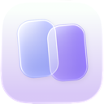

  

  <h1><a href="https://betterswitch.vercel.app/">Betterswitch</a></h1>

  
A fast, keyboard-first window switcher for macOS.

  

    
    
    
    
    
    
  

Betterswitch is a macOS menu bar window switcher for quickly finding and opening running app windows.

It is built for users who want a deeper alternative to `Command + Tab`: instead of only switching between apps, Betterswitch shows the actual open windows for each running app, including multiple Chrome, Xcode, Terminal, Finder, or other app windows.

## Features

- Menu bar only app
- Customizable global keyboard shortcuts
- Default shortcut: <kbd>⌘</kbd> + <kbd>`</kbd>
- Lists open windows from running apps
- Search apps and windows by typing
- Keyboard-first navigation with Up, Down, Return, and Escape
- Smooth centered switcher overlay
- Liquid glass styled window frames
- Custom shortcut recorder from the menu bar
- Secure automatic updates powered by Sparkle

## Installation

1. Download the latest `Betterswitch.dmg` from the [Betterswitch website](https://betterswitch.vercel.app/).
2. Open the DMG.
3. Drag `Betterswitch.app` into the `Applications` folder.
4. Open Betterswitch from Applications.

On first launch, macOS may ask for Accessibility permission. Betterswitch needs this permission to read and focus windows from other apps.

## Permissions

Betterswitch uses macOS Accessibility APIs to detect and focus windows.

To enable it manually:

1. Open **System Settings**.
2. Go to **Privacy & Security > Accessibility**.
3. Enable Betterswitch.
4. Restart Betterswitch if window switching does not work immediately.
